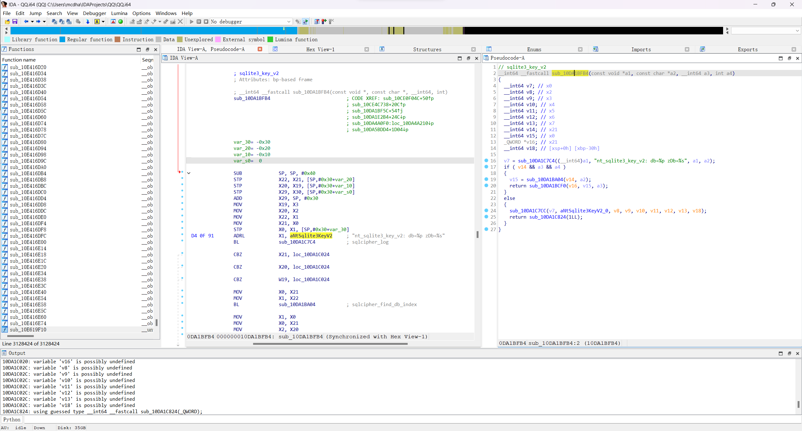
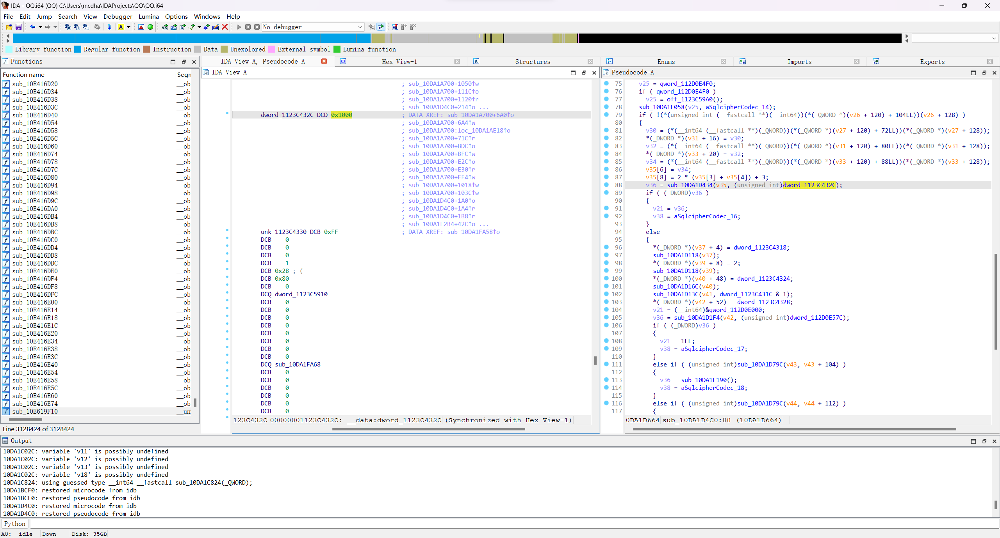
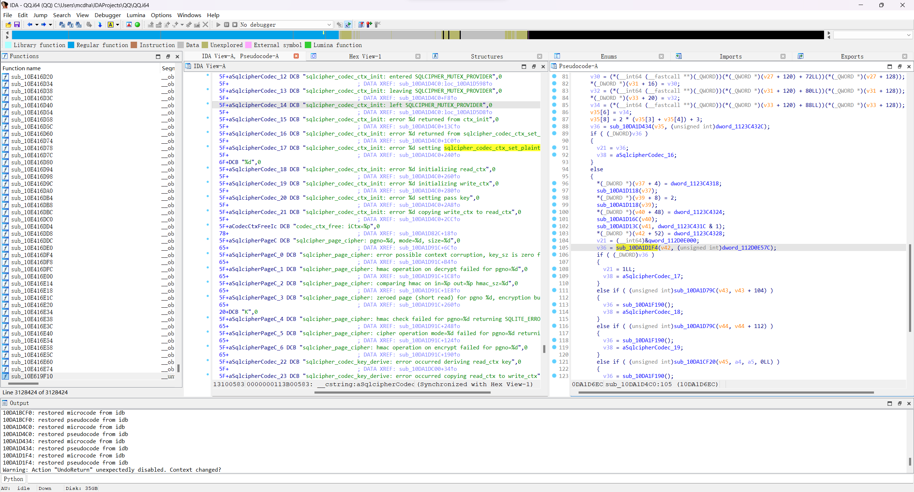

# iOS

参考了 https://github.com/QQBackup/QQ-History-Backup/issues/9 以及 https://github.com/QQBackup/qq-win-db-key 中的各平台教程。

## I 环境配置

### 越狱环境

可参考 [Frida 文档 - With Jailbreak](https://frida.re/docs/ios/#with-jailbreak)

在 iOS 设备上操作

1. Cydia / Sileo / Zebra 添加 Frida 官方软件源 `https://build.frida.re`
2. 安装 `Frida` 包
3. 在终端（NewTerm 之类的终端App，或SSH）运行：
   ```zsh
   frida-server -v
   ```
   如果端口被占用，更换其他端口，如：
   ```zsh
   frida-server --listen='0.0.0.0:27043' -v
   ```
   启动 Frida 服务端。
   > 命令前部加上 `sudo` 赋予 root 用户权限也许会更好

### 免越狱环境

目前还没有测试过，可以参考 [Frida 文档 - Without Jailbreak](https://frida.re/docs/ios/#without-jailbreak)。

## II 反编译

如果你的 QQ 版本和脚本 [ios_get_key.js](ios_get_key.js) 内注释的版本一致，可直接跳过进入下一步

如果 QQ 版本不一致，但下一步的脚本 [ios_get_key.js](ios_get_key.js) 可以正常使用，也可以忽略本节

### App 脱壳

可选工具

- dumpdecrypted (https://github.com/stefanesser/dumpdecrypted)
- frida-ios-dump (https://github.com/AloneMonkey/frida-ios-dump)
- AppsDump2（有图形界面的App，用起来很方便，不过似乎找不到它的仓库链接）
   
- ...

只需要得到脱壳后的 Mach-O 二进制主程序即可，不需要完整的 IPA 安装包。

### 反编译

本篇示例
- iOS QQ v9.0.1.620
- SQLCipher v4.5.1

**主要目的是获取 `sqlite3_key_v2` 函数位置**，页大小、纯文本文件大小、PBKDF2 迭代次数等通常是固定的。

1. 用例如 IDA 的反编译工具反编译脱壳得到的 Mach-O 二进制主程序

2. 搜索二进制片段 `sqlite3_key_v2`，可以找到日志文本，从而定位到SQLCipher C API 的 `sqlite3_key_v2` 函数在程序中的位置。第三个参数即为数据库密钥，根据传入的其他实参，还能得到更多信息。

   ```c
   int sqlite3_key_v2(sqlite3 *db, const char *zDb, const void *pKey, int nKey);
   ```
   > https://github.com/sqlcipher/sqlcipher/blob/2c672e7dd1f3dee4aa1af0b5bf29092db4b10f78/src/crypto.c#L919-L928

   得到目标函数的位置为 `000000010DA1BFB4`。由于IDA基址设为了 `0000000100000000`，两者相减，\
   **得到偏移量为 `0xDA1BFB4`，将其设置为脚本文件 [ios_get_key.js](ios_get_key.js)  中的 `SQLLiteKeyV2Offset` 的值**。

   ```javascript
   // ios_get_key.js
   const SQLLiteKeyV2Offset = 0xDA1BFB4;
   ```

   

3. 根据调用关系 `sqlite3CodecAttach`->`sqlcipher_codec_ctx_init`->`sqlcipher_codec_ctx_set_pagesize` 可以确定页大小为 `4096`

   

4. 根据调用关系 `sqlite3CodecAttach`->`sqlcipher_codec_ctx_init`->`sqlcipher_codec_ctx_set_plaintext_header_size`，\
   用 Frida hook `sqlcipher_codec_ctx_set_plaintext_header_size` 函数，可以确定纯文本文件大小为 `0`

   

## III Frida 附加到 QQ 进程，获取密钥

1. **在 PC 上安装** frida（确保 Python 已安装）：
   ```bash
   # pipx 可以把包安装到隔离的环境，避免依赖冲突
   pip install pipx
   pipx install frida
   frida --version
   ```
   > iOS 上没有编译好的 frida 工具（只有 frida-server），因此需要电脑\
   > 有试过自己编译，但总是会因为 macOS/iOS 的平台判定什么的导致运行失败（

2. 下载 [ios_get_key.js](ios_get_key.js)（如果上一步已经下载过了可以跳过）

3. iOS 设备打开 QQ App

4. **PC Frida** 连接至 iOS 设备，终端运行命令以附加脚本到 QQ 进程 \
   连接方式有两种：
   - USB 连接：
      ```
      frida -U QQ -l ios_get_key.js
      ```
   - 网络连接
      ```
      frida -H <设备IP地址>:<frida-server端口号> QQ -l ios_get_key.js
      ```
      IP地址为iOS设备的IP地址，端口号在[第一步](#越狱环境)配置过。例如：
      ```
      frida -H 192.168.1.163:27043 QQ -l ios_get_key.js
      ```
   > iOS frida-server 只能附加到已有进程，不能以 spawn 方式生成进程，原因暂不知

5. iOS 设备 QQ 进行登录操作

6. 查看 **PC 终端** 输出内容，可以看到一条条信息被输出，其中

   - **`pKey` 为数据库密钥**
   - **`zFilename` 为对应的数据库文件所在路径**

   输出的数据库信息已经过筛选。

   例如：
   ```
   +------------
   ¦- db: 0x152ec8710
   ¦- *zDb: main
   ¦- *pkey: d3c1d0f05b2cxxxxxxxxxxc1ac161c29
   ¦- *pkey-hex: ...
   ¦- nKey: 32
   ¦+
   ¦- zFilename: /var/mobile/Containers/Data/Application/22675923-xxxx-xxxx-xxxx-C1CB389E8E22/Documents/QQNT/DB/nt_db/nt_qq_15207xxxxxxxxxxxxxxxxx0d0be/nt_msg.db
   +------------
   ¦- db: 0x152ec8710
   ¦- *zDb: main
   ¦- *pkey: d3c1d0f05b2cxxxxxxxxxxc1ac161c29
   ¦- *pkey-hex: ...
   ¦- nKey: 32
   ¦+
   ¦- zFilename: /var/mobile/Containers/Data/Application/22675923-xxxx-xxxx-xxxx-C1CB389E8E22/Documents/QQNT/DB/nt_db/nt_qq_15207xxxxxxxxxxxxxxxxx0d0be/guild_msg.db
   +------------
   ```
   **复制其中的 `pKey` 和 `zFilename`**

7. 通过 SFTP 或 Filza App 等方式从 iOS 设备下载数据库文件 \
   路径为上一步的 `zFilename` 所在目录的路径，同时路径前面需要 **加上 `/private` 才是真实路径**：
   ```
   /private/var/mobile/Containers/Data/Application/22675923-xxxx-xxxx-xxxx-C1CB389E8E22/Documents/QQNT/DB/nt_db/nt_qq_15207xxxxxxxxxxxxxxxxx0d0be
   ```
   该目录下有数个数据库，除了一般的聊天记录以外还有（QQ频道记录？）更多数据。

8. 下载安装 SQLite 查看器（需支持读取SQLCipher加密的数据库），如 [DB Browser for SQLite](https://sqlitebrowser.org/)

9. 解密数据库
   - 密码：上一步获取的 **`pKey`**
   - 页大小：`4096`
   - KDF 迭代：**`4000`**
   - HMAC 算法：**`HMAC_SHA1`**
   - KDF 算法：`PBKDF2_HMAC_SHA512`
   - 纯文本文件头大小：`0`
