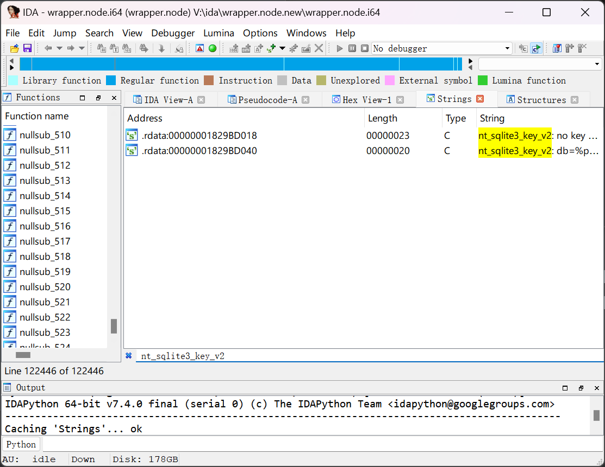
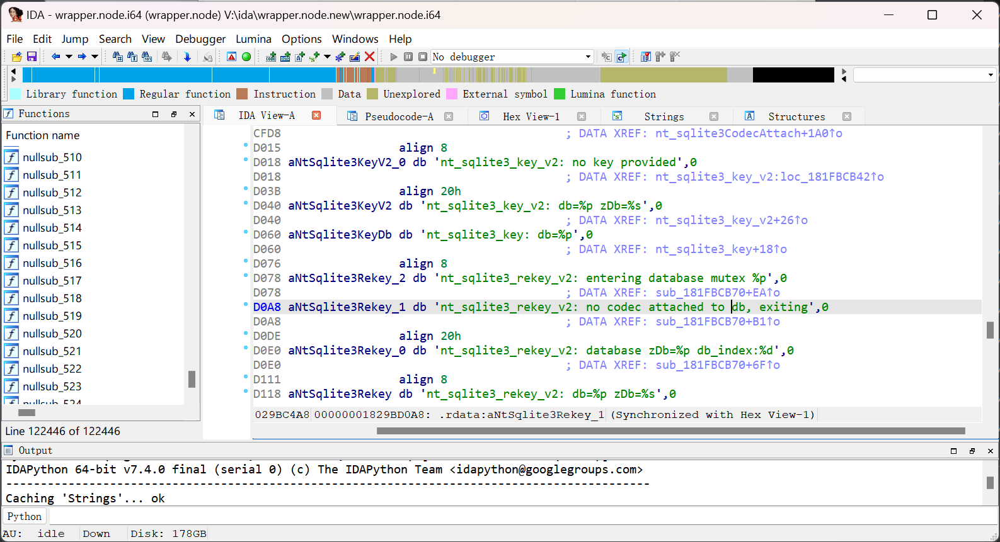
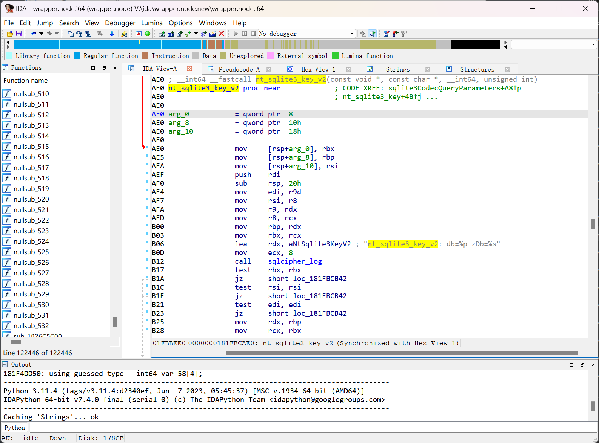

1. 定位 `nt_sqlite3_key_v2:`

   此处采用 IDA 演示，您可以替换成您喜欢的任何反编译器

   

   定位到字符串 `nt_sqlite3_key_v2: db=%p zDb=%s`

   

   在此字符串上按`x`，或右键选此字符串并选择`Jump to xref`查看引用，进入引用的函数

   

   记录函数地址，切换到 Hex View，复制从函数地址开始的一段字节序列，作为特征 Hex

   QQ 9.9.1.15043 为

   ```plain
   48 89 5C 24 08 48 89 6C  24 10 48 89 74 24 18 57
   48 83 EC 20 41 8B F9 49  8B F0 4C 8B CA 4C 8B C1
   48 8B EA 48 8B D9 48 8D  15 33 05 A0 00 B9 08 00
   ```

2. Hook 并找到 Key

   根据 <https://www.zetetic.net/sqlcipher/sqlcipher-api/#sqlite3_key> 指出

   `sqlite3_key_v2` 的签名为

   ```c
   int sqlite3_key_v2(
     sqlite3 *db,                   /* Database to be keyed */
     const char *zDbName,           /* Name of the database */
     const void *pKey, int nKey     /* The key */
   );
   ```

   其中对我们有用的是 `pKey` 和 `nKey`

   作者本人采用 frida hook

   根据 repo 提供的脚本略加修改，很容易得到我们需要的 `pKey` 和 `nKey`

   （如果你对如何修改有疑问，可以使用 [msojocs/nt-hook](https://github.com/msojocs/nt-hook/tree/4414f372ee4847be9d91d7436abb7653f8908f91) 中给出的完整脚本。注意，编译此脚本需要你的系统安装有 Node.js 环境，但编译得到的`.js`文件可以直接运行。注意，本仓库最新版本可能不能在 Windows 平台下直接使用，请自行根据 commit 信息找到可用版本（比如超链接给出的版本），或自行更改相关代码。）

   PS：有概率你会得到的一个长度为 20 的 key，但那不是我们想要的，可以挂上一个动态调试器来观察 key 对应的具体数据库

3. 打开数据库

请参考 [基础教程 - NTQQ 解密数据库](基础教程 - NTQQ 解密数据库.md)。

## 另一种解密方式、拓展应用

[QQ NT Windows 数据库解密+图片/文件清理](https://github.com/Mythologyli/qq-nt-db)：本仓库使用 IDA debugger 完成了逆向分析到解密的全过程，并实现了图片与文件清理。
